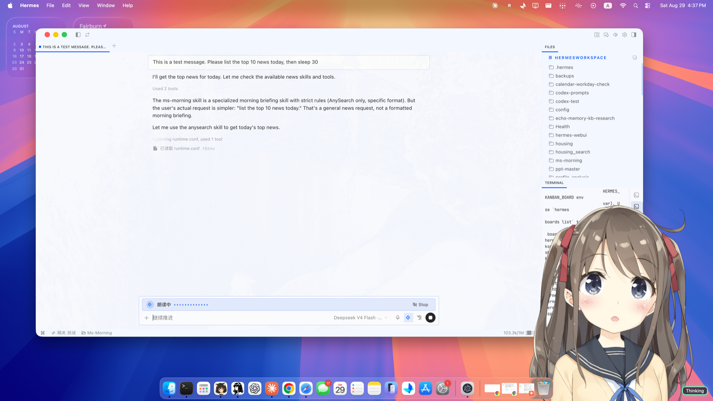
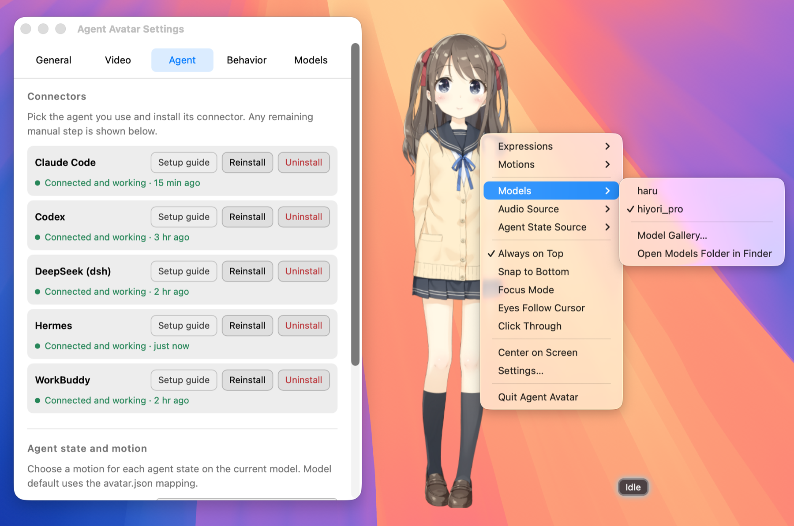
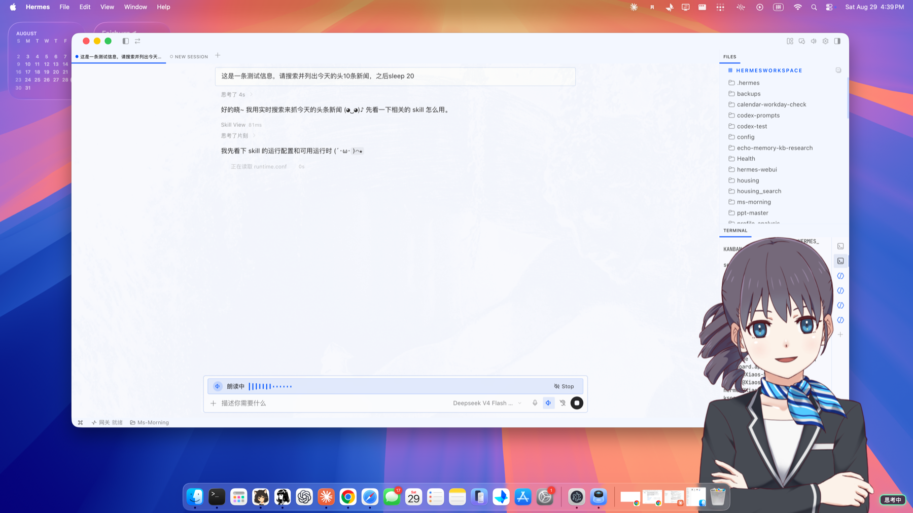
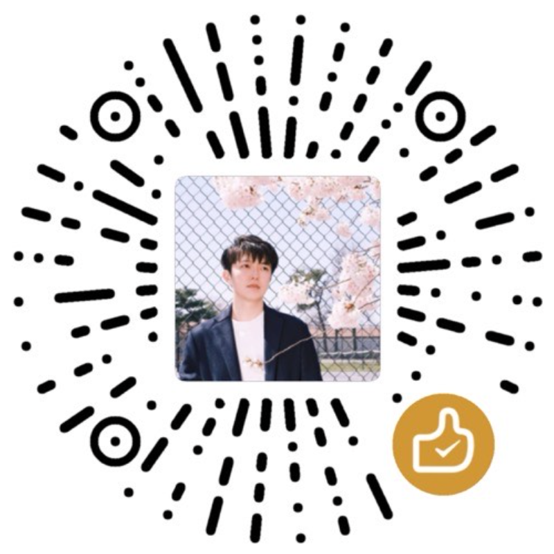

# Agent Avatar

<p align="center">
  
</p>

<p align="center">
  <a href="README.md">English</a> · <b>简体中文</b>
</p>

<p align="center">
  <a href="https://github.com/joyparkray/agent-avatar/actions/workflows/ci.yml"></a>
  
  
</p>

**不用盯着终端，也知道 agent 是在干活还是在等你。**

Agent Avatar 在桌面上放一个 Live2D 形象，把你的 AI 编程 agent 正在做的事演出来 ——
思考、跑工具、等你输入、审阅、卡住 —— agent 开口说话时还会实时对口型。

**需要 macOS 14.2 或更新。Windows 支持是下一步。**

<p align="center">
  
</p>

---

## 接哪个 agent 你定，用哪个形象你也定

桌面形象通常绑定在一个应用、一个角色上。Agent Avatar 是夹在两者之间的一层，**两头都由你挑**。

| 你的 agent | 你的形象 |
|---|---|
| **内置五家 connector** —— Claude Code、Codex、Hermes、DeepSeek Harness、WorkBuddy | **绝大多数 Live2D Cubism 3/4/5 模型** —— 买的、画的、官网下的免费模型都行 |
| **可在 app 内一键安装**，不用开终端；个别 harness 装完还需你自己做一步，向导会写明是哪一步 | **想装多少装多少**，右键菜单里随时换，不用重启 |
| **也能接自己的 harness** —— 状态约定是一份很小的公开[协议](bridge/README.md) | **加载不需要为我们做任何适配**；想让每个 agent 状态配不同动作，在设置里映射一下（或由模型自带的 `avatar.json` 决定） |
| 同时开着好几个 agent 时，跟着最近活动的那个走，也可以钉死在某一家 | 例外是用了 Cubism 5.1 离屏合成的模型 —— 会被识别并提示，而不是画错 |

中间只有一样标准：[Bridge Protocol](bridge/README.md)，以及五家共用的同一个状态机。
正是它让两头互不牵连 —— 加一家 harness 不用改形象，换一个形象也不用改 connector。

### 关于模型：为什么不随包给你一个

**出于版权考虑，我们不内置任何 Live2D 模型。** 每个模型的再分发许可都不一样，
擅自打包分发对作者不公平，也会让这个项目没法安心公开。所以：

- **不知道去哪找**：首次启动的引导卡片直接给了 [Live2D 官方免费示例模型](https://www.live2d.com/zh-CHS/learn/sample/)
  的链接，下载并解压后拖进 app 即可使用。
- **已经有喜欢的模型**：直接换上。绝大多数 Cubism 3/4/5 模型无需专门适配即可加载；
  例外是使用 Cubism 5.1 离屏合成的模型，应用会识别并提示，而不是画错。
- **你是模型作者、愿意让 Agent Avatar 随包分发你的作品**：非常欢迎，请
  [开个 issue](https://github.com/joyparkray/agent-avatar/issues) 或者联系我 ——
  会在项目里明确署名并标注授权方式。

## 你会得到什么

- **不用切回终端确认进度**：这一轮是在跑还是在等你，隔着桌子扫一眼就知道 ——
  完整的状态表在下面。
- **让会说话的 agent 有张脸**：口型可由系统音频、本地音频文件或 Hermes 语音流驱动，
  不绑定某一种语音方案。
- **在场，但不碍事**：透明悬浮、窗口置顶，人物包围盒之外的点击自动穿透；
  也可以整窗穿透，需要时在人物上悬停 3 秒就能恢复交互。
- **闲着的时候是活的**：没人理它时自己看看四周、播播动作，眼睛还能跟着鼠标；
  你一动手它立刻让位。
- **中英文全覆盖** —— 界面、状态栏、安装说明、错误提示都有两套。

## Agent 的工作，形象来演

connector 只告诉形象 **agent 正在做什么**，形象根据你的模型和设置决定**怎么演**。

| Agent 状态 | 你看到的 |
|---|---|
| `空闲` | 闲置动作，偶尔自己看看四周、播个动作 |
| `思考中` | 思考的动作与表情（内部仍区分 writing / researching） |
| `执行中` | 正在跑工具 |
| `等待中` | 在等你输入 |
| `审阅中` | 复核 / 验证 |
| `同步中` | 在和另一个 agent 或外部服务打交道 |
| `出错` | 出问题了 |

之上还叠两种反应：`受阻`（权限被拒）和`被打断`。

---

## 想改什么，右键就有

<p align="center">
  
</p>

| | |
|---|---|
| **换形象** | 装过的模型全在菜单里，随时切换、不用重启；用不上的可以隐藏，不占菜单。 |
| **模型画廊** | 一屏对比所有已装模型 —— 尺寸、动作与表情数量、映射是否有效 —— 在启用之前就能发现问题。 |
| **聚焦模式** | 只显示胸像而不是全身，占地更小；裁多少由你调。 |
| **表情 / 动作** | 菜单里可直接播；单击随机换表情、双击随机播动作，而**哪些进随机池由你勾**。 |
| **闲置自治** | 安静一阵之后它自己会动起来，用的是与「点击」分开的另一份名单 —— 打哈欠适合闲着时做，当回应就很怪。填 0 即关闭。 |
| **画质与帧率** | 三档画质 + 30/60 帧，常驻桌面的形象该花多少 GPU，由你定。 |
| **摆在哪儿** | 窗口置顶、吸附底边、回到屏幕中央，还有缩放和透明度。 |
| **眼睛跟随鼠标** | 可开可关；开着时闲置自治会自动让位，不跟鼠标抢。 |
| **点击穿透** | 整窗不再接收点击；需要互动时在人物上悬停 3 秒即可恢复。 |
| **声音来源** | 系统音频、音频文件、Hermes 语音流 —— 按你实际的语音方案选。 |
| **状态来源** | 跟着最近活动的那个 agent 走，或者钉死在某一家。 |

<p align="center">
  
</p>

<p align="center"><em>同一个应用，换个模型、切成中文 —— 都在菜单里，一步的事。</em></p>

---

## 系统要求

- **macOS 14.2 或更新**（系统音频捕获走 Core Audio process tap）。
- 一个 Live2D 模型 —— **不随包分发**，见下。
- 暂不支持 Windows —— 这是下一步要做的。

## 安装

1. 按你的芯片选对应的构建，从 [Releases](../../releases) 下载后拖进「应用程序」：

   | 你的 Mac | 文件 |
   |---|---|
   | Apple 芯片（M1/M2/M3/M4） | `Agent-Avatar-1.0.0-Apple-Silicon.dmg` |
   | Intel | `Agent-Avatar-1.0.0-Intel.dmg` |

   已用 Apple Developer ID 签名并通过公证，**直接双击打开即可**，不需要右键。
2. 启动。没装模型时会看到引导卡片，附 Live2D 官方免费模型的链接。
3. 装模型 —— 把模型文件夹拖进**设置 → 模型**，或放进卡片给你打开的模型目录。
   详见 [docs/MODELS.md](docs/MODELS.md)。
4. 接上你的 agent —— 见 [docs/CONNECTORS.md](docs/CONNECTORS.md)。

也可以[从源码构建](CONTRIBUTING.md)。

## 接上你的 agent

**最省事的装法是在 app 里点一下**：设置 → Agent → 接入，选你用的那家点「安装」，
app 会自己下载、解压、运行安装脚本，并把装完还需要你做的步骤显示出来。
首次装好模型后也会自动弹出这个向导。

下面是手动装法（离线、或想先看脚本干了什么）。每个 connector 是对应 harness 的一个插件，
把 agent 状态报给形象。安装只要跑一个脚本，
但**装完之后各家还要做的事不一样** —— 漏掉这一步是「装了没反应」最常见的原因：

| Harness | 安装 | 装完之后 |
|---|---|---|
| Claude Code | `connectors/claude-code/install-plugin.sh` | 无 |
| DeepSeek Harness | `connectors/dsh/install-plugin.sh` | 无（热加载） |
| Hermes | `connectors/hermes/install-plugin.sh` | `plugins enable agent-avatar` |
| WorkBuddy | `connectors/workbuddy/install-plugin.sh` | **重启 app** |
| Codex | `connectors/codex/install-plugin.sh` | **在会话里用 `/hooks` 逐条授信** |

Codex 那条最容易被当成 bug：插件显示已安装已启用，hook 却被静默跳过；而且授信按**内容哈希**
记账，connector 每次升级都要重新授信。详见 [docs/CONNECTORS.md](docs/CONNECTORS.md)。

然后在形象的右键菜单里选对应的**状态来源**。

---

## 设置

分五页：**通用**（语言、状态栏）、**视频**（缩放、透明度、聚焦裁切、画质、帧率）、
**Agent**（接入 connector，以及为每个状态指定动作）、**行为**（闲置自治与随机名单）、
**模型**（安装、隐藏、删除）。

---

## 目录结构

```
desktop/      macOS 应用：Live2D 渲染、音频口型、窗口与菜单（Tauri + Rust + TypeScript）
bridge/       两边共用的协议与状态机 —— 真正可被别人拿走的部分
connectors/   五家 harness 各自的适配层与安装脚本
docs/         模型安装、接入、排查
```

状态机只有一份真相（在 `bridge/`）；自包含的插件树由 `connectors/assemble.sh` **组装**产出，
不是手抄。

## 文档

- [快速上手 —— 10 分钟、无需 clone 源码](docs/QUICKSTART.zh.md)
- [模型 —— 安装、要求、什么不支持](docs/MODELS.md)
- [接入 —— 各家的设置与坑](docs/CONNECTORS.md)
- [排查](docs/TROUBLESHOOTING.md)
- [Bridge Protocol —— 想接新 harness 就看这份契约](bridge/README.md)
- [架构 —— 三层怎么拼起来的](ARCHITECTURE.md)
- [参与开发 —— 构建与测试](CONTRIBUTING.md)
- [变更记录](CHANGELOG.md)

## 支持我们

Agent Avatar 是免费开源的，用业余时间做的。如果它让你的桌面多了点生气、你想表达感谢，可以：

| 微信 | 支付宝 |
|---|---|
|  |  |

海外的话也可以走 [Buy Me a Coffee](https://buymeacoffee.com/joyparkray) 或 [PayPal](https://www.paypal.com/donate/?business=KP5WLPJ9TJBZL&no_recurring=0&currency_code=USD)。

另外，提 [issue](https://github.com/joyparkray/agent-avatar/issues)、发 [PR](https://github.com/joyparkray/agent-avatar/pulls)、点颗星，也都是一种支持。谢谢使用。❤️

## 许可

MIT，见 [LICENSE](LICENSE)。

Live2D Cubism Core 按 Live2D 自己的专有许可再分发，且**不随包分发任何 Live2D 模型**。
见 [THIRD-PARTY.md](THIRD-PARTY.md)。
